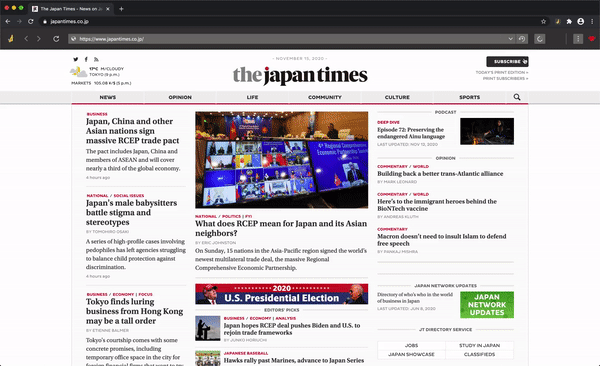

  
  
Navigator for the Web Archive

___

 > Vandal is a browser extension that helps you quickly navigate the web archive without leaving the current tab.

- [Why?](#why)
- [Features](#features)
- [Limitations](#limitations)
- [Security risks](#security)
- [Comparison to Wayback Machine](#comparison)
- [Technologies Used](#stack)

## Why?
The goal of this project is to present an alternate navigation interface focused on ease-of-use. At the same time, it tries to capture the essence of time-travel in it's own whimsical way. 

## Features
Vandal supports the following features:
- *Calendar View*: The default navigation mode which uses the least amount of surface area with a mini calendar view. Supports a custom calendar input that shows archival stats across the calendar.
- *Graph View*: Navigation mode based on graphs.
- *Navigation Panel*: A bottom panel with navigation buttons to zip through archived snapshots for a date or across the month.
- *History Panel*: Access your navigation history for a website.
- Info Panel: Access your current navigation URL and redirection info.
- *Resource Drawer*: A drawer that you can toggle to view timestamp differences of resources such as images, scripts, etc. relative to the page.
- **Historical View**: Displays the snapshots of a website throughout the years.

## Comparison to Wayback Machine
It's more of a subset to the mighty machine

